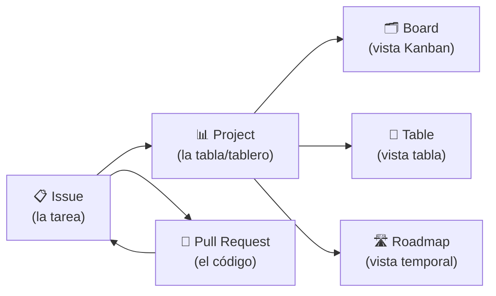

# Guía de GitHub Projects para Scrum Masters

> Material de formación para la migración de **Jira** a **GitHub Projects**.
> Objetivo: no replicar Jira tal cual, sino entender las posibilidades de GitHub Projects y definir una estructura **sencilla, homogénea y mantenible** para cada área.

---

## 1. ¿Qué es GitHub Projects?

GitHub Projects es la herramienta de planificación y seguimiento integrada en GitHub. Se construye sobre tres piezas que ya existen en el flujo de trabajo del equipo:

- **Issues**: la unidad básica de trabajo (una tarea, un bug, una historia). Equivalente a un *issue/ticket* de Jira.
- **Projects**: una tabla flexible que agrupa Issues (y Pull Requests) y les añade campos personalizados, vistas y automatizaciones. Equivalente a un *tablero/board* de Jira, pero mucho más flexible.
- **Boards / Vistas**: distintas formas de visualizar los mismos datos (tabla, tablero Kanban, roadmap) sin duplicar información.

La diferencia clave frente a Jira: en GitHub **el trabajo vive junto al código**. El mismo Issue que planificas se enlaza con las ramas, commits y Pull Requests que lo resuelven.

---

## 2. Recursos oficiales (dónde encontrar la información)

Estos son los recursos de referencia. Recomendamos revisarlos en este orden.

### 🎥 Introducción rápida – GitHub Issues & Projects
Vídeo oficial de GitHub para entender la relación entre Issues, Projects y Boards y ver un workflow básico en funcionamiento.
👉 https://www.youtube.com/watch?v=c67GaAkf1BE

### 📘 GitHub Projects – Quickstart
Guía práctica para crear y configurar un Project desde cero.
👉 https://docs.github.com/en/issues/planning-and-tracking-with-projects/learning-about-projects/quickstart-for-projects

### 📘 GitHub Projects – Best Practices
**Muy recomendable** para definir correctamente vistas, campos, automatizaciones y estructura del proyecto **antes** de trasladar la operativa desde Jira.
👉 https://docs.github.com/en/issues/planning-and-tracking-with-projects/learning-about-projects/best-practices-for-projects

### 📘 Documentación completa de GitHub Projects
Referencia completa de la funcionalidad.
👉 https://docs.github.com/en/issues/planning-and-tracking-with-projects

---

## 3. Conceptos clave

| Concepto | Descripción | Para qué sirve |
|----------|-------------|----------------|
| **Issue** | Unidad de trabajo (tarea, bug, historia). | Registrar el trabajo a hacer. |
| **Draft issue** | Nota rápida dentro del Project, sin repositorio. | Capturar ideas sin formalizar todavía. |
| **Custom fields** | Campos propios: `Status`, `Priority`, `Estimate`, `Iteration`, `Area`, etc. | Añadir metadatos igual que en Jira. |
| **Iteration field** | Campo especial de tipo iteración (sprints con fechas). | Planificar sprints. |
| **Views** | Vistas guardadas: tabla, board o roadmap, con filtros y agrupaciones. | Ver los mismos datos de distintas formas. |
| **Workflows (built-in)** | Automatizaciones nativas del Project. | Mover Issues de columna automáticamente. |
| **Labels** | Etiquetas del repositorio. | Clasificar tipo, componente, etc. |
| **Milestones** | Hitos con fecha de entrega. | Agrupar Issues por objetivo/release. |

---

## 4. Equivalencias Jira → GitHub Projects

Esta tabla es la base para planificar la migración y para configurar el script.

| Jira | GitHub Projects | Notas |
|------|-----------------|-------|
| Proyecto | Repositorio + Project | Un Project puede abarcar varios repos. |
| Issue / Ticket | Issue | Unidad de trabajo. |
| Tipo de issue (Story, Bug, Task) | **Label** (`type: story`, `type: bug`) | GitHub no tiene "tipos" nativos; se modela con labels. |
| Estado (To Do, In Progress, Done) | Campo **Status** (single select) | Se mapea 1:1 con las columnas del board. |
| Épica | Issue "padre" + label `type: epic` o sub-issues | GitHub soporta sub-issues jerárquicos. |
| Sprint | Campo **Iteration** | Sprints con fechas de inicio/fin. |
| Story Points | Campo **Estimate** (number) | Campo numérico personalizado. |
| Prioridad | Campo **Priority** (single select) | `P0`/`P1`/`P2` o `High`/`Medium`/`Low`. |
| Componente / Área | **Label** o campo **Area** | Según preferencia del equipo. |
| Asignado | **Assignee** | Requiere mapear usuarios Jira → GitHub. |
| Comentarios | Comentarios del Issue | Se migran como comentarios. |
| Adjuntos | Enlaces / adjuntos en el cuerpo | Requiere tratamiento aparte. |
| Fix Version / Release | **Milestone** | Agrupación por entrega. |
| Workflow / transiciones | **Workflows** del Project | Automatizaciones nativas + GitHub Actions. |

---

## 5. Estructura recomendada de un Project

Para conseguir tableros **homogéneos** entre áreas, recomendamos partir de esta plantilla mínima:

**Campos personalizados**
- `Status` (single select): `Backlog`, `Ready`, `In Progress`, `In Review`, `Done`
- `Priority` (single select): `P0`, `P1`, `P2`, `P3`
- `Estimate` (number): puntos de historia
- `Iteration` (iteration): sprints de duración fija (p. ej. 2 semanas)
- `Area` (single select): equipo o dominio funcional

**Labels de tipo**
- `type: epic`, `type: story`, `type: bug`, `type: task`, `type: spike`

**Vistas**
1. **Board por Status** — Kanban del sprint actual.
2. **Tabla de Backlog** — priorización, agrupada por `Priority`.
3. **Roadmap por Iteration** — visión temporal de sprints.
4. **Mi trabajo** — filtro por `assignee:@me`.

**Automatizaciones recomendadas**
- Al abrir un Issue → `Status = Backlog`.
- Al asignar → `Status = In Progress`.
- Al abrir PR que cierra el Issue → `Status = In Review`.
- Al cerrar el Issue → `Status = Done`.

---

## 6. Buenas prácticas para la migración

1. **No copies Jira tal cual.** Aprovecha para simplificar estados y limpiar el backlog.
2. **Define primero el estándar de área** (campos, labels, vistas) y aplícalo a todos los equipos.
3. **Mapea usuarios y estados antes de migrar** (ver el fichero de configuración del script).
4. **Migra por fases**: primero un equipo piloto, valida, y luego escala.
5. **Conserva la trazabilidad**: incluye el `Jira Key` original en cada Issue migrado.
6. **Automatiza lo justo**: empieza con pocas automatizaciones y añade según necesidad.
7. **Forma al equipo** con la presentación incluida en esta carpeta antes del cambio.

---

## 7. Checklist previo a la migración

- [ ] Repositorio(s) de destino creados y con permisos configurados.
- [ ] Project creado con los campos, labels y vistas del estándar de área.
- [ ] Token de GitHub con permisos `repo` y `project`.
- [ ] Token de Jira (API token) y acceso al proyecto origen.
- [ ] Mapeo de estados Jira → `Status` definido.
- [ ] Mapeo de tipos de issue → labels definido.
- [ ] Mapeo de usuarios Jira → GitHub definido.
- [ ] Prueba en un proyecto/equipo piloto.

---

## 8. Contenido de esta carpeta de formación

| Carpeta / fichero | Descripción |
|-------------------|-------------|
| `01-Documentacion/guia-github-projects.md` | Este documento. |
| `02-Presentacion/presentacion-formacion.md` | Presentación de 6 diapositivas (formato Marp). |
| `03-Script-Migracion/migrate_jira_to_github.py` | Script de migración Jira → GitHub. |
| `03-Script-Migracion/config.example.yml` | Plantilla de configuración del script. |
| `03-Script-Migracion/requirements.txt` | Dependencias de Python. |
| `03-Script-Migracion/README.md` | Cómo usar el script y el fichero de configuración. |
